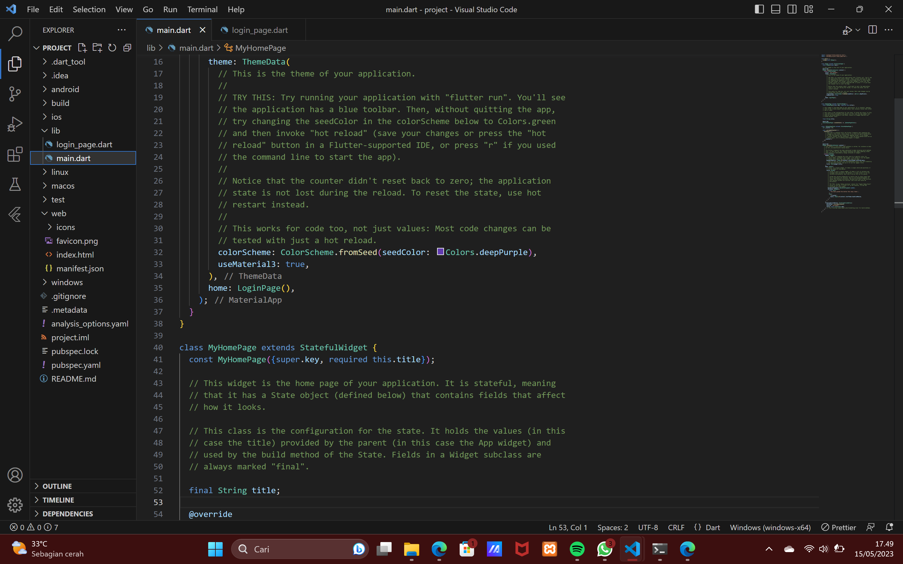
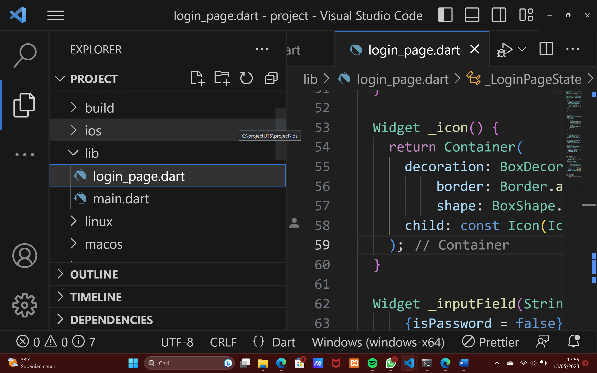
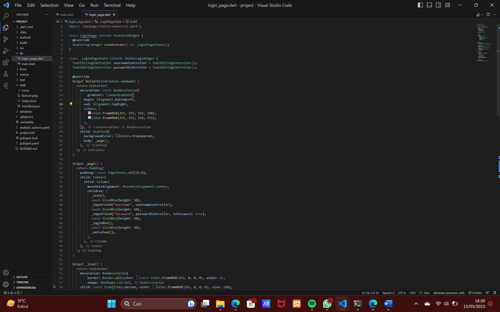
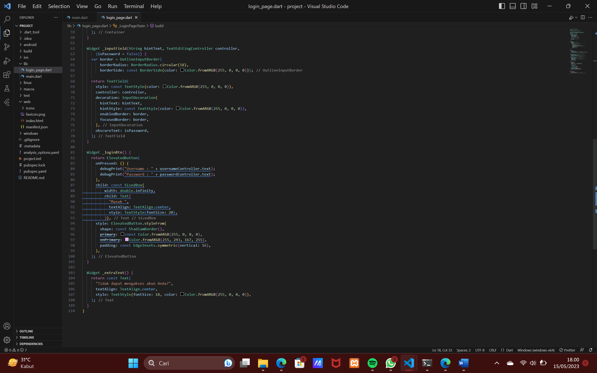
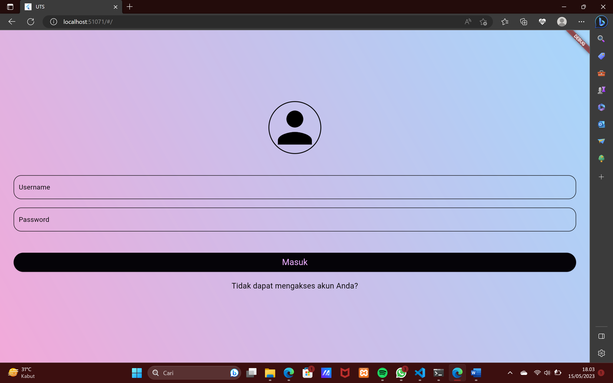

# PemogramanMobile
## Profil
| #               | Biodata              |
| --------------- | -----------------    |
| **Nama**        | Anindia Sasikirana   |
| **NIM**         | 312110268            |
| **Kelas**       | TI.21.A.2            |
| **Mata Kuliah** | Pemrograman Mobile 2 |

1.	Kita harus mengganti home: const MyHomePage(title: 'Flutter Demo Home Page'), menjadi home: LoginPage(),

2.	Lalu kita membuat Directory baru, yang dinamakan login_page.dart

3.	Kalau sudah ketik codingan seperti ini 

4. HASILNYA AKAN MENJADI SEPERTI INI

